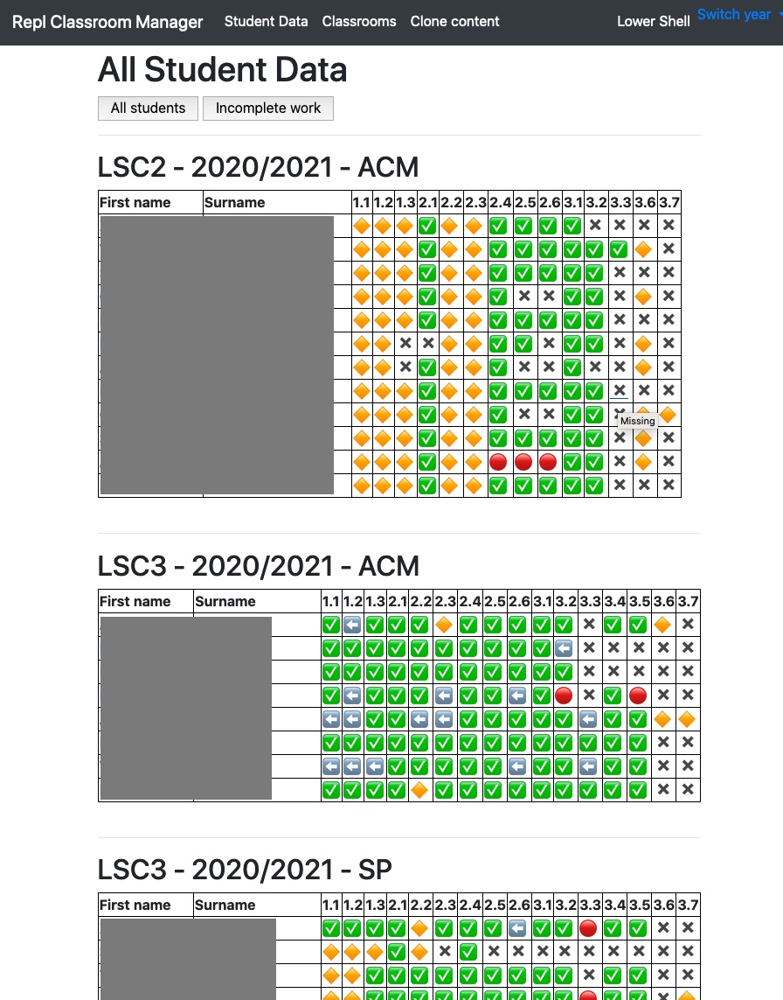

# Classroom Tracker for [repl.it](repl.it) Classroom
A basic and very quickly thrown together Python Flask app to help with tracking student progress on [repl.it](repl.it) classroom across multiple classes.

## Setup 
1. Clone the repository.
2. Install the requirements (in the repl_tracker folder) `pip install -r requirements.txt`
3. Copy `config_example.py` to `config.py` and add in your class IDs (from repl.it URLs) and the exercises you want to track. Note exercises must follow the following format `1.1 - Name of exercise`.
4. Launch the app with `python3 app.py`
5. Navigate to [http://127.0.0.1:5000](http://127.0.0.1:5000/ ).
6. Follow instructions on screen to get your cookie set up.

